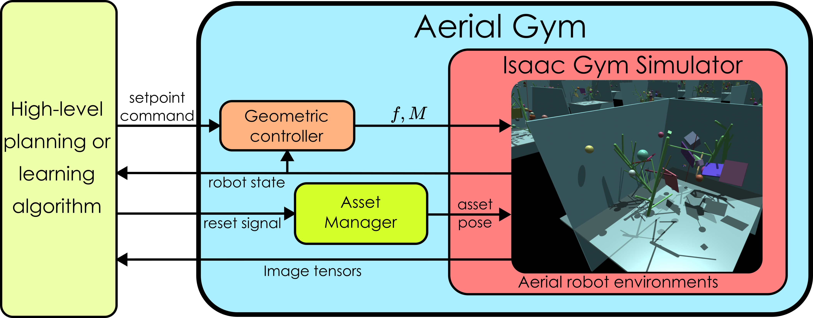
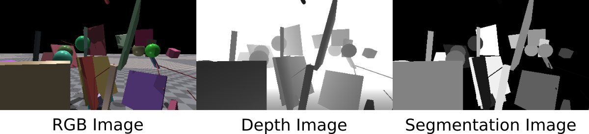

# Aerial Gym Simulator

This repository provides the environments used to train quadrotor platforms to learn to fly and navigate cluttered environments using learning-based methods. The environments are built upon the underlying NVIDIA Isaac Gym simulator. We provide simplified quadrotor models with high-level geometric controllers that operate on the GPU to provide parallelization for the simultaneous control of thousands of multirotor vehicles.

The repository contains two environments:
 - Quadrotors simulated in an obstacle-free environment.
 - Quadrotors (with simulated depth cameras) in an environment containing obstacles interfaced with the asset management functionality.

These environments are intended to be simulated on the GPU to fully exploit the parallelization capabilities.

## Paper

The paper accompanying this simulator can be found at [this link](https://arxiv.org/abs/2305.16510).
When using this work, please cite the following:
```
@misc{kulkarni2023aerial,
      title={Aerial Gym -- Isaac Gym Simulator for Aerial Robots}, 
      author={Mihir Kulkarni and Theodor J. L. Forgaard and Kostas Alexis},
      year={2023},
      eprint={2305.16510},
      archivePrefix={arXiv},
      primaryClass={cs.RO}
}
```

## Requirements
1. Ubuntu 20.04
1. [Conda](https://www.anaconda.com/download) or [Miniconda ](https://docs.conda.io/en/latest/miniconda.html)
1. [NVIDIA Isaac Gym Preview 4](https://developer.nvidia.com/isaac-gym)
1. [PyTorch](https://pytorch.org/) (No need to install this separately, this is installed with NVIDIA Isaac Gym Preview 4 (above)). 

** Note this repository has been tested on Ubuntu 20.04 with PyTorch 1.8.1.


## Installation
1. Create a new Python conda environment using NVIDIA Isaac Gym's installation instructions:
    ```bash
    cd isaacgym
    ./create_conta_env_rlgpu.sh
    ```
1. Activate the conda environment in a new shell and install isaacgym (if it is not installed already):
    ```bash
    conda activate rlgpu
    cd <path to parent folder>/isaacgym/python
    pip3 install -e .
    ```
1. Install [PyTorch3D](https://pytorch3d.org/):
    ```bash
    conda install -c fvcore -c iopath -c conda-forge fvcore iopath
    conda install -c pytorch3d pytorch3d
    ```
1. Clone and install the Aerial Gym Simulator:
    ```bash
    mkdir -p ~/workspaces/aerial_gym_ws/
    cd ~/workspaces/aerial_gym_ws/
    git clone git@github.com:ntnu-arl/aerial_gym_simulator.git
    cd aerial_gym_simulator/
    pip3 install -e .
    ```
1. Run the example script:
    ```bash
    cd aerial_gym/scripts
    python3 example.py # or python3 example.py --task="quad_with_obstacles"
    ```


# Environments and Features

## 1. Quadrotor environment without obstacles ("quad"):

Each environment contains one quadrotor model. The `self.root_states` tensor has dimensions [`<num_envs>`, 13], where the values in row `i` correspond to the robot's state in the environment `i`. Each state is defined as per the Isaac Gym interface, where the 13 elements correspond to [`pos_x`, `pos_y`, `pos_z`, `quat_x`, `quat_y`, `quat_z`, `quat_w`, `vel_x`, `vel_y`, `vel_z`, `ang_vel_x`, `ang_vel_y`, `ang_vel_z`]. These are expressed in the inertial frame of each environment.

A reward function is provided to assist a learning algorithm in training the robot to reach a setpoint using `lee_velocity_controller` and `lee_attitude_controller` to reach a desired position setpoint (in this case, set to (0,0,0) in each environment).

## 2. Quadrotor environments with obstacles ("quad_with_obstacles"):

In addition to just a robot, this example contains additional obstacles that can be randomly added to the environment. These obstacles can be found in the repository's `resources/models/environment_assets` folder. More details on adding and manipulating these obstacles can be found in the Asset Manager section.

Robots in these environments are equipped with a camera sensor capable of capturing RGB, depth, optical flow and segmentation images of the objects in the field of view. The camera attached to the robot can be enabled using the configuration parameter `env.enable_onboard_cameras = True`. This will include the camera on the robots in the simulation. Note that the camera tensors occupy a large amount of GPU memory; therefore, care must be taken to reduce the number of environments to parallelly simulate.

Additional functionality has been added to account for the difference between the frequency of the controller and that of the image acquisition from the sensors. The parameter `env.num_control_steps_per_env_step` can be set to enable this. In its default state, the controller works at a frequency of 100Hz, while the depth camera acquires images at 10Hz.

The reward function in this script is purely representative, and users are encouraged to write their own implementations to obtain a good collision avoidance behavior.


# Functionalities

We provide the simulator with parallelized geometric controllers based on [Control of Complex Maneuvers for a Quadrotor UAV using Geometric Methods on SE(3)
](https://arxiv.org/abs/1003.2005). We provide an attitude and velocity controller that operates in the vehicle frame and a position controller that controls the robot in the inertial frame of each environment.


We provide interfaces for low-level access to tensors for the robot's state. 




The above image shows the block diagram of the Aerial Gym simulator with the components to control the simulated robots, and manipulate and randomize the simulated obstacles (also called assets) in multiple parallel environments.

## 1. Controller
We implement geometric controllers from [Lee et.al.](https://arxiv.org/abs/1003.2005), adapting them to be used for parallel agents and using the GPU. A controller can be initialized from the config file(s) `aerial_robot_config.py` (or `aerial_robot_with_obstacles_config.py`) in `class control`, where the type of geometric controller is defined using the `controller` tag as a string and can take values among [`lee_position_controller`, `lee_velocity_controller`, `lee_attitude_controller`]. The constants for each controller can be tuned in the class based on the desired performance of the platform. 

```py
class control:
        """
        Control parameters
        controller:
            lee_position_control: command_actions = [x, y, z, yaw] in the inertial frame of each environment scaled between -1 and 1
            lee_velocity_control: command_actions = [vx, vy, vz, yaw_rate] in vehicle frame scaled between -1 and 1
            lee_attitude_control: command_actions = [thrust, roll, pitch, yaw_rate] in vehicle frame scaled between -1 and 1
        kP: gains for position
        kV: gains for velocity
        kR: gains for attitude
        kOmega: gains for angular velocity
        """
        controller = "lee_velocity_control" # or "lee_velocity_control" or "lee_attitude_control"
        kP = [0.8, 0.8, 1.0]
        kV = [0.5, 0.5, 0.4]
        kR = [3.0, 3.0, 1.0]
        kOmega = [0.5, 0.5, 1.20]
```


## 2. Asset Manager
We provide a class-based functionality to robustly manipulate simulated objects in the environment (called "assets") parallelly. We provide an asset manager class that can randomize a set of obstacles as required by the user and provide updated states for each obstacle in each environment. We use this to randomize the pose of the obstacles between each episode. This allows sufficient randomization for a given neural network policy to learn to avoid obstacles in the environment. In this repository, we consider obstacles defined using URDF files; however, extending to other formats is trivial.


Various URDF files can be arranged into sub-folders based on the category of obstacles they fall in. Sub-folders containing various categories can be added to this directory to provide flexibility to the user. Additional URDF files can be added in multiple folders, each consisting of a category of obstacles. The asset manager class can then be configured to randomly select files from each category using the configuration for the environment.

We provide such an example in the file `aerial_robot_with_obstacles_config.py`. We define a class for each category that sets the parameters for creating objects from that category. An example is provided below:

```py
    class tree_asset_params(asset_state_params):
        num_assets = 10 # randomly pick this many URDFs from the folder with replacement.

        max_position_ratio = [0.95, 0.95, 0.1] # min position [x_min, y_min, z_min] as a ratio of the bounds
        min_position_ratio = [0.05, 0.05, 0.0] # max position [x_max, y_max, z_max] as a ratio of the bounds

        specified_position = [-1000.0, -1000.0, -1000.0] # if > -900, use this value instead of randomizing the ratios

        min_euler_angles = [0, -np.pi/6.0, -np.pi] # min euler angles [roll, pitch, yaw]
        max_euler_angles = [0, np.pi/6.0, np.pi] # max euler angles [roll, pitch, yaw]

        specified_euler_angle = [-1000.0, -1000.0, -1000.0] # if > -900, use this value instead of randomizing

        collapse_fixed_joints = True # collapse fixed joints into a single link
        links_per_asset = 1 # defines number of links per asset. Workaround is to read links manually from URDF file.
        set_whole_body_semantic_mask = False # sets a single semantic mask for the whole body.
        set_semantic_mask_per_link = True # sets a semantic mask for each link.
        # (NOTE: only one of set_semanic_mask_per_link and set_whole_body_semantic_mask can be True)
        semantic_mask_link_list = [] # All links are labeled if link names not specified. Works with set_semantic_mask_per_link parameter.
        semantic_id = TREE_SEMANTIC_ID # semantic id for the whole asset. Works with set_whole_body_semantic_mask parameter.
        color = [70,200,100] # color of the asset
```

Finally, all asset configurations can be aggregated into one class that can be modified control which of the assets are included in the environments with the help of a boolean flag:

```py
class asset_config:
        folder_path = f"{AERIAL_GYM_ROOT_DIR}/resources/models/environment_assets"
        
        include_asset_type = {
            "thin": True, 
            "trees": True, 
            "objects": True
            }
            
        include_env_bound_type = {
            "front_wall": False, 
            "left_wall": False, 
            "top_wall": False, 
            "back_wall": False,
            "right_wall": False, 
            "bottom_wall": False}

        env_lower_bound_min = [-5.0, -5.0, 0.0] # lower bound for the environment space
        env_lower_bound_max = [-5.0, -5.0, 0.0] # lower bound for the environment space
        env_upper_bound_min = [5.0, 5.0, 5.0] # upper bound for the environment space
        env_upper_bound_max = [5.0, 5.0, 5.0] # upper bound for the environment space
```

The onboard camera in the `aerial_robot_with_obstacles.py` file can capture images from the simulated sensor. An example of RGB, depth and segmentation images can be seen below:


# Example RL training

We provide example scripts that show the interfacing of the given environment (without obstacles) with learning agents.
Since this repository only provides parallelized environments, we leave room for users to use the learning frameworks of their choice.

We provide example scripts to demonstrate the interfacing of the environment with two available learning frameworks. 

## 1. [CleanRL](https://github.com/vwxyzjn/cleanrl)
We modify the available code to interface with the "quad" environment. The provided script trains a neural network to successfully navigate towards a goal setpoint (in this case, the origin of each environment).

The training scripts can be run using the following commands:

```bash
cd aerial_gym/rl_training/cleanrl/
python3 ppo_continuous_action.py
```

The latest model is saved every 50 update steps and can be loaded using the `--checkpoint` argument.

A sample video of environments trained using cleanRL is shown below:


## 2. [rl_games](https://github.com/Denys88/rl_games)

Like the above, we provide an example script to train the robot to reach a position goal. The commands to run the training for this are:

Note: This requires an installation of rl_games repository. This version is tested with rl_games version 1.1.4. A recommended way to install rl_games is by installing [IsaacGymEnvs](https://github.com/NVIDIA-Omniverse/IsaacGymEnvs). This gives you additional environments interface with IsaacGym alongside the rl_games package.

```bash
cd aerial_gym/rl_training/rl_games
python3 runner.py
```


## Contributors

[Mihir Kulkarni](mailto:mihir.kulkarni@ntnu.no)

[Theodor J. L. Forgaard](mailto:tjforgaa@stud.ntnu.no)

[Kostas Alexis](mailto:konstantinos.alexis@ntnu.no)

## Acknowledgements
This material was supported by the AFOSR Award No. FA8655-21-1-7033.

This repository shares some of the code and helper scripts from [https://github.com/leggedrobotics/legged_gym](https://github.com/leggedrobotics/legged_gym).

---


## Known issues

```bash
python3 example.py --task="quad_with_obstacles" # in Ubuntu 22.04, when enable_onboard_cameras=True, does not occur when False.
[Error] [carb.gym.plugin] cudaImportExternalMemory failed on rgbImage buffer with error 999
```

Possible cause - conflicting environment package versions. Similar issue detailed in [https://forums.developer.nvidia.com/t/cudaimportexternalmemory-failed-on-rgbimage/212944](https://forums.developer.nvidia.com/t/cudaimportexternalmemory-failed-on-rgbimage/212944).