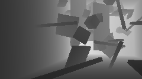

# Sensors and Rendering

## Enabling Sensors in Simulation

The sensors can be chosen and enabled or disabled before each robot by editing the robot config file:
```python
class sensor_config:
    enable_camera = True
    camera_config = BaseDepthCameraConfig

    enable_lidar = False
    lidar_config = BaseLidarConfig  # OSDome_64_Config

    enable_imu = False
    imu_config = BaseImuConfig
```

## Warp Sensors

We develop a set of sensors using NVIDIA Warp. We create custom implementations of ray-casting based sensors to obtain depth, range, pointcloud, segmentation and surface normal information from the environment. The various sensors that are provided out-of-the-box are listed below, along with the customization options that are available.

Some common configurable parameters for the sensors are described below:

```python
height = 128 # height of image or number of scan lines in the LiDAR sensor
width = 512 # width of the image or number of points per scan line in the LiDAR sensor
horizontal_fov_deg_min = -180 # minimum horizontal FoV in degrees
horizontal_fov_deg_max = 180 # maximum horizontal FoV in degrees
vertical_fov_deg_min = -45 # minimum vertical FoV in degrees
vertical_fov_deg_max = +45 # maximum vertical FoV in degrees
max_range = 10.0 # maximum range
min_range = 0.2 # minimum range
calculate_depth = True # Calculate depth image / setting false will return range. (Only for camera sensors)
return_pointcloud = False  # Return a pointcloud [x,y,z] instead of an image
pointcloud_in_world_frame = False # Pointcloud are expressed in the robot or world frame
segmentation_camera = True  # Also return a segmentation image
normalize_range = True  # normalize values 0 and 1 w.r.t sensor range limits.
```

### Depth Camera

The depth camera sensor provides depth information about the environment. The sensor can be configured with different field of view (FOV) and resolution settings. The depth camera can be used to generate depth images, point clouds, and surface normals.


For this sensor model, the vertical and horizontal FOV are related to each other with the relation

$$\textrm{vfov} = 2 \arctan(\tan(\textrm{hfov}/2) * \textrm{height}/\textrm{width}).$$

The depth image is then returned as a  tensor `[num_envs, num_sensor_per_robot, vertical_pixels, horizontal_pixels]` where the last two dimensions are the vertical and horizontal pixels of the depth image. The Aerial Gym Simulator can also return the pointcloud of the environment on setting `calculate_pointcloud = True` in the sensor configuration file. This is returned as a 4D tensor `[num_envs, num_sensor_per_robot, vertical_pixels, horizontal_pixels, 3]` where the last dimension is the 3D coordinates of the point.


!!!Note
    When a range / depth image is returned, the information is returned in the dimensions `[num_envs, num_sensor_per_env, vertical_pixels, horizontal_pixels]`, however in case the [segmentation camera](#segmentation-camera) option is selected, another tensor with the same dimensions is initialized to store this information. In case the option to return data as pointcloud is selected, the data is returned as a 4D tensor `[num_envs, num_sensor_per_env, vertical_pixels, horizontal_pixels, 3]` where the last dimension is the 3D coordinates of the point in the world frame.

Some examples of the depth image obtained using this sensor is shown below:

 

### Lidar

A LiDAR sensor is modeled after the configuration of an Ouster OS0-128 sensor. The sensor can be configured with a different FoV, resolution, range and noise settings. The sensor allows to return a range-image and the pointclouds of the environments, along with segmentation images and also the surface normals. Similar to many popular existing implementations, this implementation performs ray-casting of all the rays after the physics step is performed. This does not take into account the spinning of the lidar and the change in the robot position during one scan of the lidar.

An idealized lidar sensor is used to perform ray-casting. The ray direction for each ray is calculated using the horizontal and vertical FOV of the sensor. The ray direction is calculated as follows:


$$ \textrm{ray}[i, j] = \begin{bmatrix} \cos(\phi) \times \cos(\theta) \\ \sin(\phi) \times \cos(\theta) \\ \sin(\theta) \end{bmatrix}, $$

where $\phi$ is the azimuth angle and $\theta$ is the elevation angle. The azimuth and elevation angles range from the maximum to the minimum FOV of the sensor in the horizontal and vertical directions respectively.

??? example "Code for initializing ray directions for a LiDAR Sensor"
    ```python
    for i in range(self.num_scan_lines):
        for j in range(self.num_points_per_line):
            # Rays go from +HFoV/2 to -HFoV/2 and +VFoV/2 to -VFoV/2
            azimuth_angle = self.horizontal_fov_max - (
                self.horizontal_fov_max - self.horizontal_fov_min
            ) * (j / (self.num_points_per_line - 1))
            elevation_angle = self.vertical_fov_max - (
                self.vertical_fov_max - self.vertical_fov_min
            ) * (i / (self.num_scan_lines - 1))
            ray_vectors[i, j, 0] = math.cos(azimuth_angle) * math.cos(elevation_angle)
            ray_vectors[i, j, 1] = math.sin(azimuth_angle) * math.cos(elevation_angle)
            ray_vectors[i, j, 2] = math.sin(elevation_angle)
    # normalize ray_vectors
    ray_vectors = ray_vectors / torch.norm(ray_vectors, dim=2, keepdim=True)
    ```


For both the [Depth Camera](#depth-camera) and the [LiDAR](#lidar) sensors, the measurements can be returned as range and/or depth images and also as pointclouds. The pointclouds can be returned in the world frame or the sensor frame by setting the parameter `pointcloud_in_world_frame = True` in the sensor configuration file.

Sample LiDAR renderings are shown below:

 


### Segmentation Camera

The segmentation camera is provided combined with the depth or the LiDAR sensor. The segmentation camera provides a segmentation image of the environment. In the Isaac Gym rendering framework, the segmentation information can be embedded in each link of the asset in the environment, however for possibility of faster rendering and more flexibility, we allow our Warp environment representation to include the segmentation information per vertex of the mesh. Practically, this method hijacks the velocity field of each vertex in the mesh to encode the segmentation information. The segmentation information is then queried from a particular vertex of each face intersecting the ray cast from the sensor origin. While we provide the capbility equivalent to what is provided in the Isaac Gym rendering framework, this can easily be extended to include more information for the mesh or to have more complex segmentation information that can be assigned to vertices associated with particular faces (triangles) in the mesh.

The segmentation camera is associated with the depth/range or the LiDAR sensor, and can only be enabled by setting a flag `segmentation_camera = True` in the sensor configuration file. Moreover, the segmentation camera queries the mesh directly to read the `velocities` field of the vertex data and use the first element (x-velocity field) of the first vertex of the face to encode and read the segmentation information from the mesh face.

??? example "Segmentation Camera Kernel Code"
    ```python
    if wp.mesh_query_ray(
        mesh, ray_origin, ray_direction_world, far_plane, t, u, v, sign, n, f
    ):
        dist = t
        mesh_obj = wp.mesh_get(mesh)
        face_index = mesh_obj.indices[f * 3]
        segmentation_value = wp.int32(mesh_obj.velocities[face_index][0])
    if pointcloud_in_world_frame:
        pixels[env_id, cam_id, scan_line, point_index] = (
            ray_origin + dist * ray_direction_world
        )
    else:
        pixels[env_id, cam_id, scan_line, point_index] = dist * ray_dir
    segmentation_pixels[env_id, cam_id, scan_line, point_index] = segmentation_value
    ```

The segmentation camera's output for the corresponding depth images for the camera are shown below:

 

 


Similarly, for the LiDAR sensor, the range and segmentation image outputs are shown below:

 

 


### Custom Sensors
While the framework to implement the Depth Cameras and the LiDAR sensors is provided, it can be modified to simulate custom sensors as per the user's needs. For example, ToF cameras and single ray range sensors can be designed and used in the simulator. Alternatively, the implementations provided can be modified to obtain exclusively segmentation information or the scene flow information from the simulator.

### Randomizing Sensor Placement

Moreover, the sensors can have randomized placement and orientation. By default, this happens at each `<sensor>.reset()`, however, as opposed to Isaac Gym sensors, this can also be done at each timestep by the user without introducing any slowdown.  The parameters for randomizing the placement and orientation of the sensors are shown below, and can be changed in the respective config files:

??? example "Randomizing Sensor Placement and Orientation"
    ```python
    # randomize placement of the sensor
    randomize_placement = True
    min_translation = [0.07, -0.06, 0.01] # [m] # Max translation limits of the sensor for [x, y, z] axes
    max_translation = [0.12, 0.03, 0.04] # [m] # Minimum translation limits of the sensor for [x, y, z] axes
    min_euler_rotation_deg = [-5.0, -5.0, -5.0] # [deg] # Minimum rotation limits of the sensor for [x, y, z] axes
    max_euler_rotation_deg = [5.0, 5.0, 5.0] # [deg] # Maximum rotation limits of the sensor for [x, y, z] axes

    # nominal position and orientation (only for Isaac Gym Camera Sensors)
    # this is done as randomizing the placement of the camera at each reset is slow
    nominal_position = [0.10, 0.0, 0.03] # [m] # Nominal position of the sensor in the robot frame
    nominal_orientation_euler_deg = [0.0, 0.0, 0.0] # [deg] # Nominal orientation of the sensor in the robot frame
    ```

### Simulating sensor noise

We provide two sensor noise models. The first is a pixel dropout model where a pixel in the image is randomly set to zero with a probability `pixel_dropout_prob`. The second is a pixel noise model where the pixel values are perturbed by a Gaussian noise with a standard deviation of `pixel_std_dev_multiplier` times the pixel value. The parameters for the sensor noise models are shown below:

```python
class sensor_noise:
    enable_sensor_noise = False
    pixel_dropout_prob = 0.01
    pixel_std_dev_multiplier = 0.01
```
!!! question "Should I use Warp or Isaac Gym sensors?"
    This depends on your use case. If you are simulating dynamic environments, Isaac Gym sensors are required. If you are using an implementation that is provided by both frameworks and you only want simulation speed, it is highly recommended to use warp. As a general observation, Warp worked faster generally and we specifically saw orders of magnitude speedups while simulating single or multiple low-dimensional sensors (such as 8x8 ToF sensors) per robot, while the Isaac Gym sensor was slightly better for our case when dealing with many complex meshes in the environment.

    However Isaac Gym sensors cannot simulate LiDARs or any custom sensor model. If you need better customizability and capability to randomize sensor paramters such as pose, or projection model of the sensors on-the-fly, then our Warp implementation is recommended. Here, the position, orientation, camera matrix, ray casting direction etc can be changed or randomized at each timestep (whoaaa!!!) without introducing much delays. If you want to embed additional information in your environment itself that can be queried by the sensors, our Warp implementation is a natural optionas this allows for an immensely powerful rendering framework.

### Isaac Gym Camera sensors

!!! danger "Using both Isaac Gym and Warp rendering"
    Enabling both Warp and Isaac Gym rendering pipelines together can cause a slowdown in the simulation and has not been extensively tested. It is recommended to use one rendering pipeline at a time.

We provide wrappers to enable the use of Isaac Gym cameras with the robots in the simulator. These camera sensors are provided as-is from the Isaac Gym interface. The sensors offered include RGB, Depth, and Segmentation and Optical Flow cameras. Isaac Gym Simulator does not provide all the customization options that we offer with the Warp-based sensors. However, we provide a standardized interface to use these sensors with the robots in the simulator.


### IMU Sensor

An IMU sensor is implemented that can calculate the acceleration and angular rates of the robot. The sensor is configured by default to be mounted at the origin of the base link of the robot, while the orientation is configurable. This is done as the IMU is implemented using the Force sensor in Isaac Gym and cannot account for centripetal forces and gyroscopic effects. The IMU measurement is obtained as follows:

$$ a_{\textrm{meas}} = a_{\textrm{true}} + b_a + n_a, $$

$$ \omega_{\textrm{meas}} = \omega_{\textrm{true}} + b_{\omega} + n_{\omega}, $$

where, $a_{\textrm{meas}}$ and $\omega_{\textrm{meas}}$ are the measured acceleration and angular rates, $a_{\textrm{true}}$ and $\omega_{\textrm{true}}$ are the true acceleration and angular rates, $b_a$ and $b_{\omega}$ are the biases, and $n_a$ and $n_{\omega}$ are the noise terms. The noise terms are modeled as Gaussian noise with standard deviations $\sigma_{n_a}$ and $\sigma_{n_{\omega}}$ respectively. The biases are modeled as random walk processes with parameters $\sigma_{a}$ and $\sigma_{\omega}$ respectively.

??? note "The bias model for the IMU"
    is a random walk model and the parameters set for the provided sensor are obtained from a VN-100 IMU. Using an IMU requires the force sensor to be enabled on the robot asset configuration.


    $$ b_{a,k} = b_{a,k-1} + \sigma_{a} \cdot \mathcal{N}(0,1) / \sqrt{\Delta t}, $$

    $$ b_{\omega,k} = b_{\omega,k-1} + \sigma_{\omega} \cdot \mathcal{N}(0,1) \cdot \sqrt{\Delta t}, $$

    where $b_{a,k}$ and $b_{\omega,k}$ are the biases at time $k$, $\sigma_{a}$ and $\sigma_{\omega}$ are the bias random walk parameters, $\Delta t$ is the time step, $a_{\textrm{meas}}$ and $\omega_{\textrm{meas}}$ are the measured acceleration and angular rates, $a_{\textrm{true}}$ and $\omega_{\textrm{true}}$ are the true acceleration and angular rates, $b_a$ and $b_{\omega}$ are the biases, The noise terms $n_a$ and $n_{\omega}$ are modeled as:

    $$ n_a = \sigma_{n_a} \cdot \mathcal{N}(0,1) / \sqrt{\Delta t}, \textrm{and} $$

    $$ n_{\omega} = \sigma_{n_{\omega}} \cdot \mathcal{N}(0,1) / \sqrt{\Delta t}. $$

