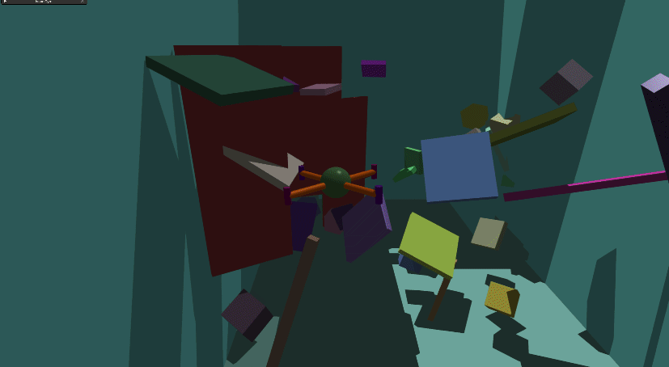

[](https://opensource.org/licenses/BSD-3-Clause) [](https://github.com/psf/black) [](https://arxiv.org/abs/2503.01471)

# [:arl-arl-logo: Aerial Gym Simulator](index.md)

Welcome to the documentation of the Aerial Gym Simulator &nbsp;&nbsp; [:fontawesome-brands-github:](https://www.github.com/ntnu-arl/aerial_gym_simulator)

The Aerial Gym Simulator is a high-fidelity physics-based simulator for training Micro Aerial Vehicle (MAV) platforms such as multirotors to learn to fly and navigate cluttered environments using learning-based methods. The environments are built upon the underlying [NVIDIA Isaac Gym](https://developer.nvidia.com/isaac-gym) simulator. We offer aerial robot models for standard planar quadrotor platforms, as well as fully-actuated platforms and multirotors with arbitrary configurations. These configurations are supported with low-level and high-level geometric controllers that reside on the GPU and provide parallelization for the simultaneous control of thousands of multirotors.

This is the *second release* of the simulator and includes a variety of new features and improvements. Task definition and environment configuration allow for fine-grained customization of all the environment entities without having to deal with large monolithic environment files. A custom rendering framework allows obtaining depth, and segmentation images at high speeds and can be used to simulate custom sensors such as LiDARs with varying properties. The simulator is open-source and is released under the [BSD-3-Clause License](https://opensource.org/licenses/BSD-3-Clause).

!!! success "**Support for Unified Autonomy Stack**"
      Support for the [Unified Autonomy Stack](https://ntnu-arl.github.io/unified_autonomy_stack/) is now available! Training instructions can be found in the [RL Training](./6_rl_training.md#rl-training-for-the-unified-autonomy-stack) page.


<div style="display:grid; grid-template-columns:repeat(2,1fr); gap:0.5rem; margin-bottom:1rem;">
  <figure style="margin:0; text-align:center;">
    
    <figcaption>State-based control in under a minute</figcaption>
  </figure>
  <figure style="margin:0; text-align:center;">
    
    <figcaption>Vision-based navigation in under an hour</figcaption>
  </figure>
</div>

## Features

!!! note ""
    - **Modular and Extendable Design** — easily create custom environments, robots, sensors, tasks, and controllers, and change parameters programmatically on-the-fly via the [Simulation Components](./4_simulation_components.md).
    - **Rewritten from the Ground-Up** — very high control over each simulation component with extensive [customization](./5_customization.md) capabilities.
    - **High-Fidelity Physics Engine** — leverages [NVIDIA Isaac Gym](https://developer.nvidia.com/isaac-gym/download) for simulating multirotor platforms, with support for custom physics backends and rendering pipelines.
    - **Parallelized Geometric Controllers** — reside on the GPU and provide parallelization for the [simultaneous control of thousands of multirotors](./3_robots_and_controllers.md/#controllers).
    - **Custom Rendering Framework** — based on [NVIDIA Warp](https://nvidia.github.io/warp/), used to design [custom sensors](./8_sensors_and_rendering.md/#warp-sensors) and perform parallelized kernel-based operations.
    - **Fully Customizable** — create [custom environments](./5_customization.md/#custom-environments), [robots](./5_customization.md/#custom-robots), [sensors](./5_customization.md/#custom-sensors), [tasks](./5_customization.md/#custom-tasks), and [controllers](./5_customization.md/#custom-controllers).
    - **RL-based control and navigation policies** — [includes scripts to get started with training your own robots](./6_rl_training.md).


!!! success "**Support for Isaac Lab**"
      Support for [Isaac Lab](https://isaac-sim.github.io/IsaacLab/) and [Isaac Sim](https://developer.nvidia.com/isaac/sim) is now available! Multirotor/thruster actuator, multirotor asset, and manager-based ARL drone task have been added in [Isaac Lab v2.3.2](https://isaac-sim.github.io/IsaacLab/main/source/refs/release_notes.html#v2-3-2).

## Results using the Aerial Gym Simulator

<div style="display: grid; grid-template-columns: 1fr 1fr; gap: 1rem;">
  <iframe style="width:100%; aspect-ratio:16/9;" src="https://www.youtube.com/embed/l8Su8OXsM-E?si=ob8saIRWcnYyUU9a&rel=0&iv_load_policy=3&modestbranding=1" title="YouTube video player" frameborder="0" allow="accelerometer; autoplay; clipboard-write; encrypted-media; gyroscope; picture-in-picture; web-share" referrerpolicy="strict-origin-when-cross-origin" allowfullscreen></iframe>
  <iframe style="width:100%; aspect-ratio:16/9;" src="https://www.youtube.com/embed/bleQPb1kVI8?si=K5ekAv5vaXvLPq0A&rel=0&iv_load_policy=3&modestbranding=1" title="YouTube video player" frameborder="0" allow="accelerometer; autoplay; clipboard-write; encrypted-media; gyroscope; picture-in-picture; web-share" referrerpolicy="strict-origin-when-cross-origin" allowfullscreen></iframe>
  <iframe style="width:100%; aspect-ratio:16/9;" src="https://www.youtube.com/embed/MFGoRqg4TPU?si=qkGHqMBvtmcHXQhp&rel=0&iv_load_policy=3&modestbranding=1" title="YouTube video player" frameborder="0" allow="accelerometer; autoplay; clipboard-write; encrypted-media; gyroscope; picture-in-picture; web-share" referrerpolicy="strict-origin-when-cross-origin" allowfullscreen></iframe>
  <iframe style="width:100%; aspect-ratio:16/9;" src="https://www.youtube.com/embed/qC_XuFj7prY?si=rnl34Dw-OM3A4Lg8&rel=0&iv_load_policy=3&modestbranding=1" title="YouTube video player" frameborder="0" allow="accelerometer; autoplay; clipboard-write; encrypted-media; gyroscope; picture-in-picture; web-share" referrerpolicy="strict-origin-when-cross-origin" allowfullscreen></iframe>
  <iframe style="width:100%; aspect-ratio:16/9;" src="https://www.youtube.com/embed/V6w_DTKWvtc?si=T7qzIRDWdVjtSI_q&rel=0&iv_load_policy=3&modestbranding=1" title="YouTube video player" frameborder="0" allow="accelerometer; autoplay; clipboard-write; encrypted-media; gyroscope; picture-in-picture; web-share" referrerpolicy="strict-origin-when-cross-origin" allowfullscreen></iframe>
  <iframe style="width:100%; aspect-ratio:16/9;" src="https://www.youtube.com/embed/vAXLmalLo80?si=ohrgq1XZRkeFKGRN&rel=0&iv_load_policy=3&modestbranding=1" title="YouTube video player" frameborder="0" allow="accelerometer; autoplay; clipboard-write; encrypted-media; gyroscope; picture-in-picture; web-share" referrerpolicy="strict-origin-when-cross-origin" allowfullscreen></iframe>
  

  <iframe style="width:100%; aspect-ratio:16/9;" src="https://www.youtube.com/embed/OO2P4N0drGc?si=zZWTwY8_YOvLNkme&rel=0&iv_load_policy=3&modestbranding=1" title="YouTube video player" frameborder="0" allow="accelerometer; autoplay; clipboard-write; encrypted-media; gyroscope; picture-in-picture; web-share" referrerpolicy="strict-origin-when-cross-origin" allowfullscreen></iframe>
  <iframe style="width:100%; aspect-ratio:16/9;" src="https://www.youtube.com/embed/gPrT21sbpTY?si=nwxICvoI0Jq4d3zX&rel=0&iv_load_policy=3&modestbranding=1" title="YouTube video player" frameborder="0" allow="accelerometer; autoplay; clipboard-write; encrypted-media; gyroscope; picture-in-picture; web-share" referrerpolicy="strict-origin-when-cross-origin" allowfullscreen></iframe>

  <iframe style="width:100%; aspect-ratio:16/9;" src="https://www.youtube.com/embed/Ni4VywUQCPw?si=PD3bUpQ4kHMD8-76" title="YouTube video player" frameborder="0" allow="accelerometer; autoplay; clipboard-write; encrypted-media; gyroscope; picture-in-picture; web-share" referrerpolicy="strict-origin-when-cross-origin" allowfullscreen></iframe>

  <iframe style="width:100%; aspect-ratio:16/9;" src="https://www.youtube.com/embed/lY1OKz_UOqM?si=n19tW4ei5wDB8Gm6&rel=0&iv_load_policy=3&modestbranding=1" title="YouTube video player" frameborder="0" allow="accelerometer; autoplay; clipboard-write; encrypted-media; gyroscope; picture-in-picture; web-share" referrerpolicy="strict-origin-when-cross-origin" allowfullscreen></iframe>
</div>


## Why Aerial Gym Simulator?

The Aerial Gym Simulator is designed to simulate thousands of MAVs simultaneously and comes equipped with both low and high-level controllers that are used on real-world systems. In addition, the new customized ray-casting allows for superfast rendering of the environment for tasks using depth and segmentation from the environment.

The optimized code in this newer version allows training for motor-command policies for robot control in under a minute and vision-based navigation policies in under an hour. Extensive examples are provided to allow users to get started with training their own policies for their custom robots quickly.


## Citing
The paper for this simulator is available on [arXiv:2503.01471](https://arxiv.org/abs/2503.01471) and [IEEE Xplore](https://ieeexplore.ieee.org/abstract/document/10910148/). When referencing the Aerial Gym Simulator in your research, please cite:

```bibtex
@article{kulkarni2025aerial,
  title={Aerial gym simulator: A framework for highly parallelized simulation of aerial robots},
  author={Kulkarni, Mihir and Rehberg, Welf and Alexis, Kostas},
  journal={IEEE Robotics and Automation Letters},
  year={2025},
  publisher={IEEE}
}
```

If you use the reinforcement learning policy provided alongside this simulator for navigation tasks, please cite the following paper:

```bibtex
@INPROCEEDINGS{kulkarni2024@dceRL,
  author={Kulkarni, Mihir and Alexis, Kostas},
  booktitle={2024 IEEE International Conference on Robotics and Automation (ICRA)}, 
  title={Reinforcement Learning for Collision-free Flight Exploiting Deep Collision Encoding}, 
  year={2024},
  volume={},
  number={},
  pages={15781-15788},
  keywords={Image coding;Navigation;Supervised learning;Noise;Robot sensing systems;Encoding;Odometry},
  doi={10.1109/ICRA57147.2024.10610287}}
```

## Quick Links
For your convenience, here are some quick links to the most important sections of the documentation:

- [Installation](./2_getting_started.md/#installation)
- [Robots and Controllers](./3_robots_and_controllers.md)
- [Sensors and Rendering Capabilities](./8_sensors_and_rendering.md)
- [RL Training](./6_rl_training.md)
- [Simulation Components](./4_simulation_components.md)
- [Customization](./5_customization.md)
- [Sim2Real Deployment](./9_sim2real.md)
- [FAQs and Troubleshooting](./7_FAQ_and_troubleshooting.md)


## Contact

Mihir Kulkarni  &nbsp;&nbsp;&nbsp; [Email](mailto:mihirk284@gmail.com) &nbsp; [GitHub](https://github.com/mihirk284) &nbsp; [LinkedIn](https://www.linkedin.com/in/mihir-kulkarni-6070b6135/) &nbsp; [X (formerly Twitter)](https://twitter.com/mihirk284)

Welf Rehberg &nbsp;&nbsp;&nbsp;&nbsp; [Email](mailto:welf.rehberg@ntnu.no) &nbsp; [GitHub](https://github.com/Zwoelf12) &nbsp; [LinkedIn](https://www.linkedin.com/in/welfrehberg/)

Theodor J. L. Forgaard &nbsp;&nbsp;&nbsp; [Email](mailto:tjforgaa@stud.ntnu.no) &nbsp; [GitHb](https://github.com/tforgaard) &nbsp; [LinkedIn](https://www.linkedin.com/in/theodor-johannes-line-forgaard-665b5311a/)

Kostas Alexis &nbsp;&nbsp;&nbsp;&nbsp; [Email](mailto:konstantinos.alexis@ntnu.no) &nbsp;  [GitHub](https://github.com/kostas-alexis) &nbsp;
 [LinkedIn](https://www.linkedin.com/in/kostas-alexis-67713918/) &nbsp; [X (formerly Twitter)](https://twitter.com/arlteam)

This work is done at the [Autonomous Robots Lab](https://www.autonomousrobotslab.com), [Norwegian University of Science and Technology (NTNU)](https://www.ntnu.no). For more information, visit our [Website](https://www.autonomousrobotslab.com/).


## Acknowledgements
This material was supported by RESNAV (AFOSR Award No. FA8655-21-1-7033) and SPEAR (Horizon Europe Grant Agreement No. 101119774).

This repository utilizes some of the code and helper scripts from [https://github.com/leggedrobotics/legged_gym](https://github.com/leggedrobotics/legged_gym) and [IsaacGymEnvs](https://github.com/isaac-sim/IsaacGymEnvs).


## FAQs and Troubleshooting

Please refer to our [website](https://ntnu-arl.github.io/aerial_gym_simulator/7_FAQ_and_troubleshooting/) or to the [Issues](https://github.com/ntnu-arl/aerial_gym_simulator/issues) section in the GitHub repository for more information.
